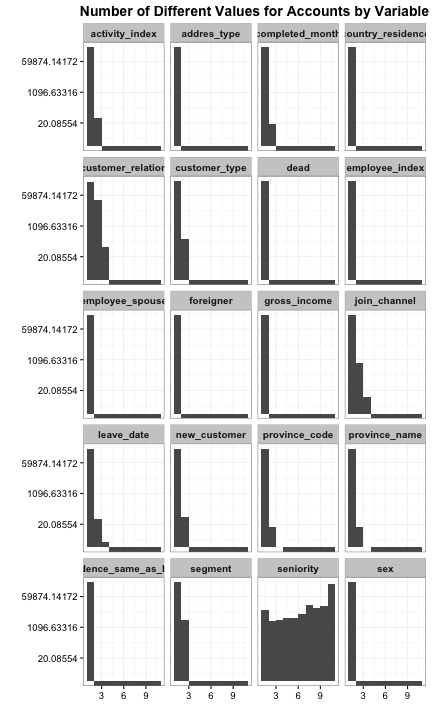

# Matt's Data Documentation

AJ has done an awesome job of jumping into the data and playing around with
distributions and missing values. I'm going to try to document the 
information we know already and create a report on the variables themselves.
This should make it easier for us to pick up the project if we get busy and
can't work on it every other day. 


```r
train_data <- read_csv("~/Documents/Data/Kaggle_Comps/Santander/train_ver2.csv", col_types = col_types, progress = F)

account_data <- select(train_data, fecha_dato:segmento) %>% clean_names

quick_look <- function(x){
  var_info <- data_frame(Type = class(x)[1],
             Unique_Values = n_distinct(x),
             Num_missing = sum(is.na(x)))
  return(var_info)
}

var_info <- account_data %>%
  mutate(signup_time = as.numeric(difftime(fetch_date, signup_date, units = "days"))) %>%
  select(-customer_code, -dplyr::contains("date")) %>%
  peruse
```

|        Variable        |   Class   | Num_Missing | Num_Unique |
|:----------------------:|:---------:|:-----------:|:----------:|
|     employee_index     | Character |    27734    |     6      |
|   country_residence    | Character |    27734    |    119     |
|          sex           | Character |    27804    |     3      |
|          age           |  Numeric  |    27734    |    121     |
|      new_customer      |  Numeric  |    27734    |     3      |
|       seniority        |  Numeric  |    27734    |    259     |
|    completed_month     |  Numeric  |    27734    |     3      |
|     customer_type      | Character |   149781    |     10     |
|   customer_relation    | Character |   149781    |     6      |
| residence_same_as_bank | Character |    27734    |     3      |
|       foreigner        | Character |    27734    |     3      |
|    employee_spouse     | Character |  13645501   |     3      |
|      join_channel      | Character |   186126    |    163     |
|          dead          | Character |    27734    |     3      |
|      addres_type       |  Numeric  |    27735    |     2      |
|     province_code      |  Numeric  |    93591    |     53     |
|     province_name      | Character |      0      |     53     |
|     activity_index     |  Numeric  |    27734    |     3      |
|      gross_income      |  Numeric  |   2794375   |   520995   |
|        segment         | Character |   189368    |     4      |
|      signup_time       |  Numeric  |    27734    |    7781    |

### Numeric Variables


|    Variable     |  Type   | Num_Missing | Num_Unique | First_Quartile |   Max    |  Mean   | Median |  Min   |        SD         | Third_Quartile |
|:---------------:|:-------:|:-----------:|:----------:|:--------------:|:--------:|:-------:|:------:|:------:|:-----------------:|:--------------:|
|       age       | Numeric |    27734    |    121     |       24       |   164    |  40.18  |   39   |   2    | 17.1850869688224  |       50       |
|  new_customer   | Binary  |    27734    |     3      |       0        |    1     | 0.05956 |   0    |   0    | 0.236673265822979 |       0        |
|    seniority    | Numeric |    27734    |    259     |       23       |   256    |  76.59  |   50   | -1e+06 | 1671.80654687343  |      135       |
| completed_month | Binary  |    27734    |     3      |       1        |    99    |  1.178  |   1    |   1    | 4.17746865732697  |       1        |
|   addres_type   | Numeric |    27735    |     2      |       1        |    1     |    1    |   1    |   1    |         0         |       1        |
|  province_code  | Numeric |    93591    |     53     |       15       |    52    |  26.57  |   28   |   1    | 12.7840167594191  |       35       |
| activity_index  | Binary  |    27734    |     3      |       0        |    1     | 0.4578  |   0    |   0    | 0.498216888293769 |       1        |
|  gross_income   | Numeric |   2794375   |   520995   |     68710      | 28890000 | 134300  | 101800 |  1203  | 230620.238821886  |     156000     |
|   signup_time   | Numeric |    27734    |    7781    |      688       |   7803   |  2444   |  1573  |   -3   | 2035.81842776023  |      4184      |

It looks like `new_customer`, `completed_month`, and `activity_index` are 
actually binary variables that we can turn into character values.

### Character Variables


|        Variable        |   Type    | Num_Missing | Num_Unique |                                          most_common                                           |
|:----------------------:|:---------:|:-----------:|:----------:|:----------------------------------------------------------------------------------------------:|
|     employee_index     | Character |    27734    |     6      |                       A - 2492, B - 3566, F - 2523, N - 13610977, S - 17                       |
|   country_residence    | Character |    27734    |    119     |                   AR - 4835, DE - 4625, ES - 13553710, FR - 5161, GB - 4605                    |
|          sex           |  Binary   |    27804    |     3      |                                    H - 6195253, V - 7424252                                    |
|     customer_type      | Character |   149781    |     10     |                   1 - 4357298, 1.0 - 9133383, 3 - 1570, 3.0 - 2780, P - 874                    |
|   customer_relation    | Character |   149781    |     6      |                       A - 6187123, I - 7304875, N - 4, P - 4656, R - 870                       |
| residence_same_as_bank |  Binary   |    27734    |     3      |                                    N - 65864, S - 13553711                                     |
|       foreigner        |  Binary   |    27734    |     3      |                                    N - 12974839, S - 644736                                    |
|    employee_spouse     |  Binary   |  13645501   |     3      |                                        N - 1791, S - 17                                        |
|      join_channel      | Character |   186126    |    163     |            KAT - 3268209, KFA - 409669, KFC - 3098360, KHE - 4055270, KHQ - 591039             |
|          dead          |  Binary   |    27734    |     3      |                                    N - 13584813, S - 34762                                     |
|     province_name      | Character |      0      |     53     | BARCELONA - 1275219, CORUÑA, A - 429322, MADRID - 4409600, SEVILLA - 605164, VALENCIA - 682304 |
|        segment         | Character |   189368    |     4      |          01 - TOP - 562142, 02 - PARTICULARES - 7960220, 03 - UNIVERSITARIO - 4935579          |

### Variable Drift

The data is structured as monthly measurements for accounts for 17 months. 
I'm curious to find out how often the variables change month to month. 


```r
cal_data <- train_data %>%
  make_calibration %>%
  clean_names %>%
  select(fetch_date:segment)

cols <- names(cal_data)[!(names(cal_data) %in% c("fetch_date", "age", "signup_date"))]

cal_df <- as.data.table(cal_data)
account_nums <- cal_df[, cols, with = F][, lapply(.SD, n_distinct), by = customer_code]
```

```
## Error in .subset(x, j): invalid subscript type 'list'
```

```r
account_nums %>%
  as.tbl %>%
  gather(Variable, Number, -customer_code) %>%
  ggplot(aes(x = Number)) +
  geom_histogram(binwidth = 1, boundary = 0) +
  facet_wrap(~Variable, nrow = 5, ncol = 4) +
  theme_mells +
  ylab("") +
  xlab("") +
  scale_y_continuous(trans = "log") +
  theme(strip.text = element_text(face = "bold", size = 10)) +
  ggtitle("Number of Different Values for Accounts by Variable")
```

```
## Warning: Stacking not well defined when ymin != 0
```



